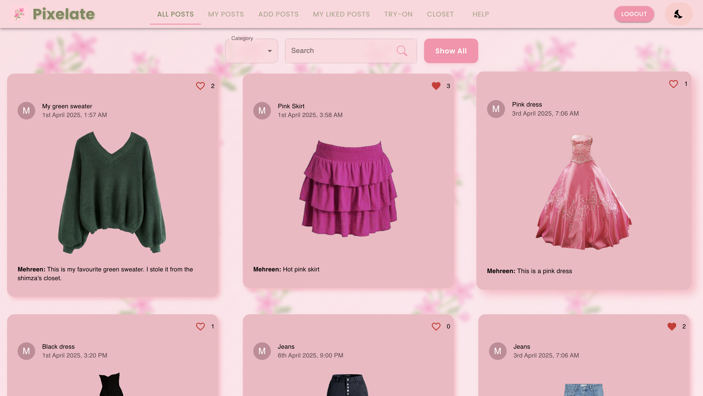
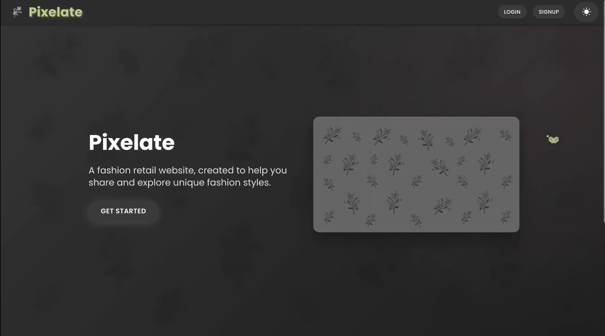
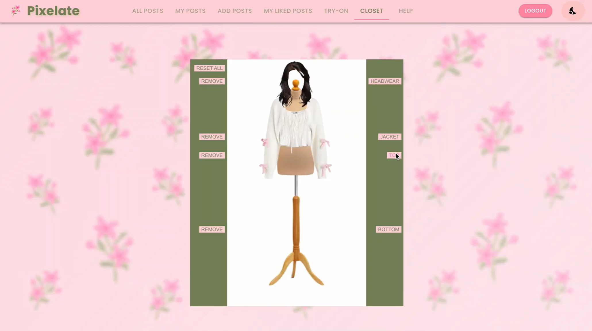

# Pixelate

## Overview

This project so far includes a backend and frontend for a web app that handles user login and signup. Currently, the backend and frontend are not connected, but both parts work independently.

## Prerequisites

Before you start, ensure that you have the following installed on your computer:

- [Node.js](https://nodejs.org/) (which includes npm)
- A code editor like [VS Code](https://code.visualstudio.com/)

## Getting Started

1. **Clone the repository** or download the project files to your local machine.
    ```bash
    git clone https://github.com/muskanmorshed/pixelate.git
    cd pixelate
    ```
## Backend
1. **Navigate to the backend directory**:
   ```bash
   cd backend
    ```
2. **Start the backend server**:
    ```bash
    npm start
    ```
This will start the backend server.

## Frontend
Open a new terminal:
1. **Navigate to the frontend directory**:
    ```bash
    cd frontend
    ```
2. **Install dependencies**:
    ```bash
    npm install
    npm install framer-motion @dnd-kit/core moment-timezone
    ```
3. **Start the frontend server**:
    ```bash
    npm start
    ```
This will open the frontend web application in your browser.

## To Run tests
    npm test

## Troubleshooting
- If you encounter issues with the backend, make sure that you have the correct environment variables set up.
- If the frontend does not open automatically, try navigating to `http://localhost:3000` or `http://localhost:3001` manually in your browser.

## Future Improvements
- More clothing options for tbe try-on feature and closet
- Deploy website so that is accessible online
- Posts can be deleted from `All Posts` page

## Screenshots
<div style="display: flex; justify-content: center; flex-wrap: wrap;">
    
    
</div>

<div style="display: flex; justify-content: center; flex-wrap: wrap;">
    
    
    
</div>
Landing page, All Posts page, Dark mode on landing page, Closet feature, Try-On Feature


## Authors:
- Malasa Khan
- Mehreen Morshed
- Muskan Morshed
- Shimza Warraich
