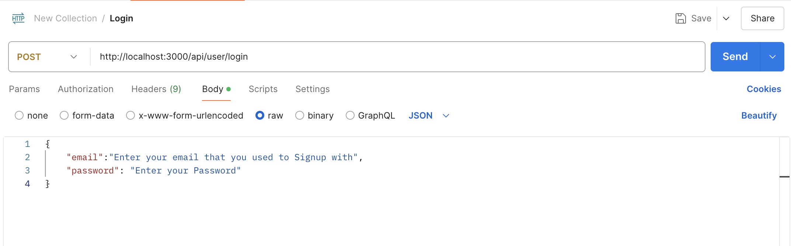
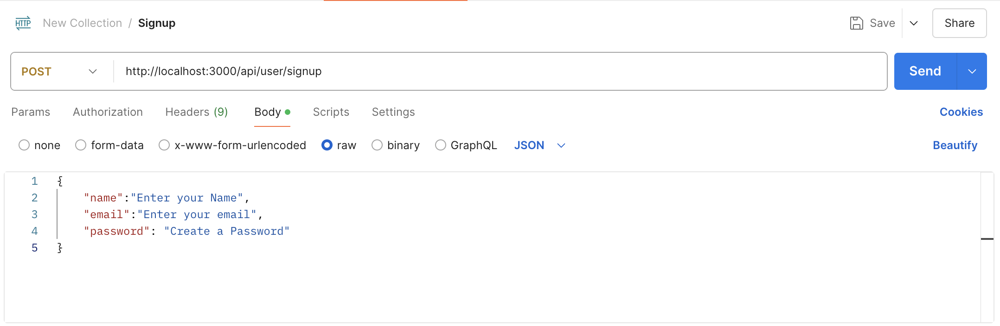

# Pixelate

## Overview

This project so far includes a backend and frontend for a web app that handles user login and signup. Currently, the backend and frontend are not connected, but both parts work independently.

## Prerequisites

Before you start, ensure that you have the following installed on your computer:

- [Node.js](https://nodejs.org/) (which includes npm)
- [Postman](https://www.postman.com/downloads/) for testing API requests
- A code editor like [VS Code](https://code.visualstudio.com/) (optional, for editing the code)

## Getting Started

1. **Clone the repository** or download the project files to your local machine.
    ```bash
    git clone https://github.com/muskanmorshed/pixelate.git
    ```
## Backend Setup
1. **Navigate to the backend directory**:
   ```bash
   cd backend
    ```
2. **Install dependencies**:
    ```bash
    npm install
    ```
3. **Start the backend server**:
    ```bash
    npm start
    ```
This will start the backend server and the APi will be available for testing in Postman.

## Testing the Backend with Postman
1. **Open Postman**
2. **To test the login functionality**: 
- send a **POST** request to the backend API URL `http://localhost:3000/user/signup`
- Enter login credentials in the request body.
- Click on the **`Send`** button


The response will indicate whether login was successful or incorrect password.

3. **To test the signup functionality**:   
- Enter signup credentials in the request body.
- Click on the **`Send`** button



4. **To get all users**:
- Click the **`Send`** button
- List of all the users will be shown


 This list is stored in **MongoDB**

## Frontend
1. **Navigate to the backend directory**:
    ```bash
    cd frontend
    ```
2. **Install dependencies**:
    ```bash
    npm install
    ```
3. **Start the frontend server**:
    ```bash
    npm start
    ```
    This will open the frontend web application in your browser.

## To Run tests
    npm test

## Troubleshooting
- If you encounter issues with the backend, make sure that you have the correct environment variables set up.
- If the frontend does not open automatically, try navigating to `http://localhost:3000` manually in your browser.

## Future Improvements
- Connect the frontend to the backend so that the login and signup functionality works end-to-end.
- Implement error handling and form validation in the frontend.
- Implement feature for adding and deleting posts
- Implement feature for saving posts
- Homepage design
##
### Authors:
- Malasa Khan
- Mehreen Morshed
- Muskan Morshed
- Shimza Warraich
